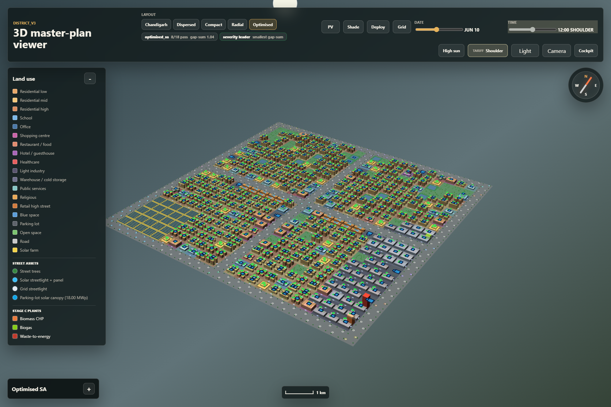
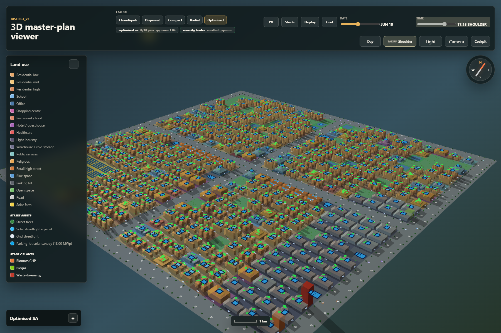
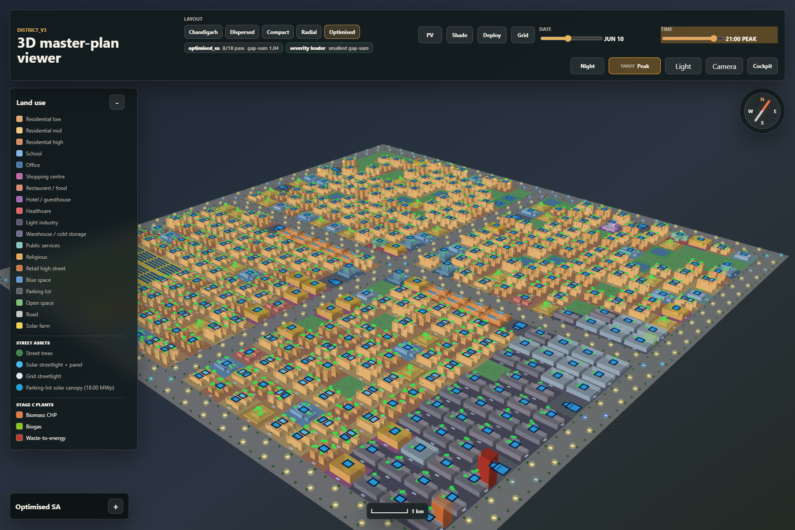
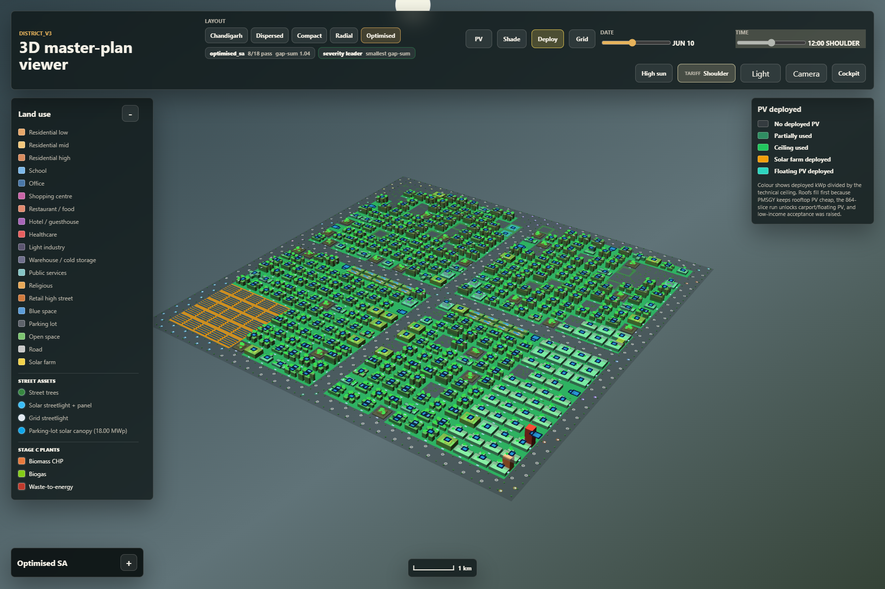
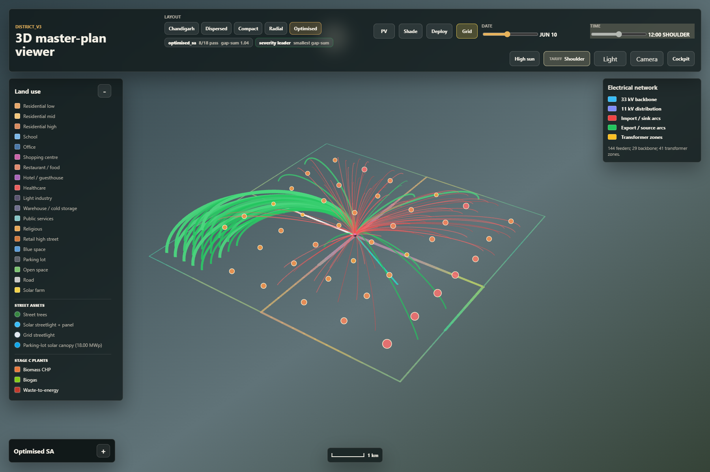
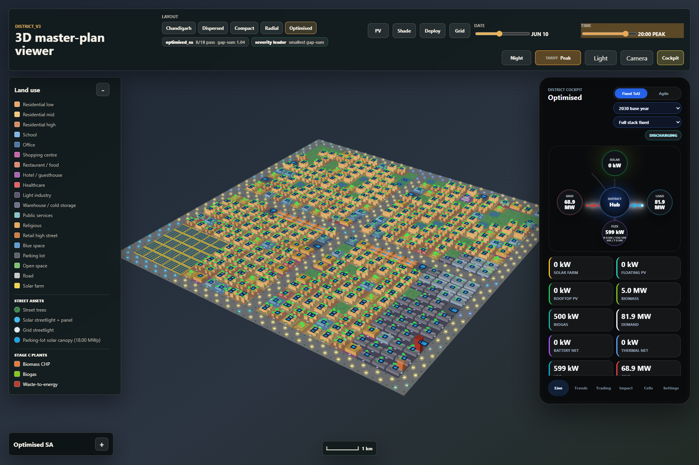

# Urban Design + Energy Co-Optimisation - a 3D Digital Twin of a Net-Zero Indian New Town

**MSc Thesis - Sustainable Energy Futures, Imperial College London (2025-26)**

A platform that designs a new town **and** its clean-energy system *together* - then renders the result as an interactive 3D digital twin you can fly through, with a live energy cockpit driven by the real optimisation results.

> **Source code:** kept private by design. This is an active research project I intend to open-source on my own timeline, so the optimisation engine is not published here. Happy to walk through it live (screen-share / interview).

<!-- HERO VIDEO: drag-and-drop district_v3_viewer_demo.mp4 into this line while editing on github.com.
GitHub will host it and render an inline player. Delete this comment after. -->

---

## Headline results

A 25 km² (5 x 5 km) new town for ~100,000 people near Zirakpur, Punjab - designed from demographics up, powered to 2055.

| Metric (2030, vs a conventional grid-only town) | Value |
|---|---|
| Annual energy-system cost | **-44%** |
| Operational CO₂ | **-57%** |
| Renewable supply share | **59%** (46% solar self-consumed + biomass / waste-to-energy / biogas) |
| Net cost of energy served | **~3.97 INR/kWh** |
| Equity | **The poorest residents save the most (~52% lower bills)**, via government-owned rooftop PV and a 3 INR/kWh social tariff |

And the design is honest about time: the model plans in three investment periods (2030 / 2042 / 2055) with capex learning curves, panel degradation and a decarbonising grid - so the numbers above are the *start* of a 25-year trajectory, not a single snapshot.

---

## The idea

Master-planning a new town and planning its energy system are normally done separately, one after the other. That misses the biggest lever: **how a district is laid out - building heights, street orientation, shading, where demand sits, how much roof faces the sun - changes how much energy it needs in the first place.**

This project treats layout and energy as **one coupled optimisation problem**:

1. **Urban-design layer.** A simulated-annealing optimiser places land use, building heights and a connected road network across a **625-cell grid**, under 20+ statutory planning constraints (URDPFI / IPHS norms) and 30+ scored objectives: solar access, passive cooling, walkability, equity of amenity access.
2. **Energy layer.** Given that layout, a Pyomo / HiGHS linear program co-optimises what to **build** (rooftop / ground-mount / carport / floating / facade solar, batteries, vehicle-to-grid, biomass / waste-to-energy / biogas) and how to **run it hour-by-hour**, across **864 representative time-slices** per year and three investment periods to 2055.

The two layers share one physics: the same sun-position and shadow geometry that lights the 3D scene also derates every roof's PV yield in the optimiser.

---

## The 3D digital twin

*The optimised district: buildings extruded by height, colour-coded land use, solar farm, carport canopies and energy plant - ~25 render layers in deck.gl / WebGL.*

*A date / time slider moves the sun correctly for the site's latitude; buildings cast geometry-accurate shadows. The same shadow engine feeds the energy model's per-cell PV yield.*

*Night mode: lit buildings and the solar / grid streetlight split from the model.*

*Where the optimiser actually put solar: rooftops fill first, then carports, floating PV and the ground-mount farm.*

*The distribution network at noon: export arcs from PV-rich cells, import arcs into demand-heavy ones, transformer zones from the spatial (Stage D) model.*

*The live cockpit: generation, storage, vehicle-to-grid and grid exchange per hour, tariff curves, and the 2030 / 2042 / 2055 period selector - every number from the optimiser's solution file.*

More screenshots in [`media/`](media/).

---

## What makes it interesting (beyond the headline)

- **It finds non-obvious results.** Zero batteries at 2030 India costs (capex is ~277x the reliability value - and the model proves it stays uneconomic even as battery prices halve by 2055, because the PV-saturated district has shrinking midday surplus). A "green" data-centre power-purchase agreement that *raises* emissions above a specific price. Dynamic retail tariffs that cost a solar-heavy district +24%.
- **Equity is a first-class output.** Per-income-tier bills, peer-to-peer trading settlement, the social-tariff transfer, and per-owner payback / NPV - who pays, who saves, who needs co-financing.
- **It audits itself.** The published solution is re-verified independently of the solver (energy balance to the kWh, every cap, every conservation law), and the project keeps a public-style findings register of its own bugs and fixes - the same discipline expected of production energy models.

---

## Under the hood (engine, kept private)

| Layer | Approach |
|---|---|
| Urban design | Simulated annealing over a 625-cell grid, 20+ hard constraints, 30+ objectives |
| Energy system | Pyomo / HiGHS LP, 864 time-slices x 3 periods (2030/2042/2055), vintaged capacity with learning curves |
| Realism | Geometric shading, temperature / soiling / fog PV derating, monsoon cooling shapes, festival / weekend occupancy, EV charging by income tier, grid-decarbonisation trajectory |
| Equity | Tariff transfers, P2P settlement, social tariff, per-owner NPV - kept outside the cost optimisation as a report layer, so subsidies never distort the engineering optimum |
| Verification | Byte-exact regression pins + independent solution-feasibility tests (balance, caps, conservation) |
| Scale | ~24,000 lines (Python + JavaScript), 269-case test suite |
| Stack | Python - Pyomo - HiGHS - NumPy / pandas - deck.gl / WebGL - GeoJSON |

---

## Demo

The screen-recording above is the quickest look (no setup needed). For a deeper walkthrough or a live look at the codebase, I am happy to arrange one.

---

*Aryan Bansal - MSc Sustainable Energy Futures, Imperial College London - [LinkedIn](https://www.linkedin.com/in/aryanbansal1210)*
