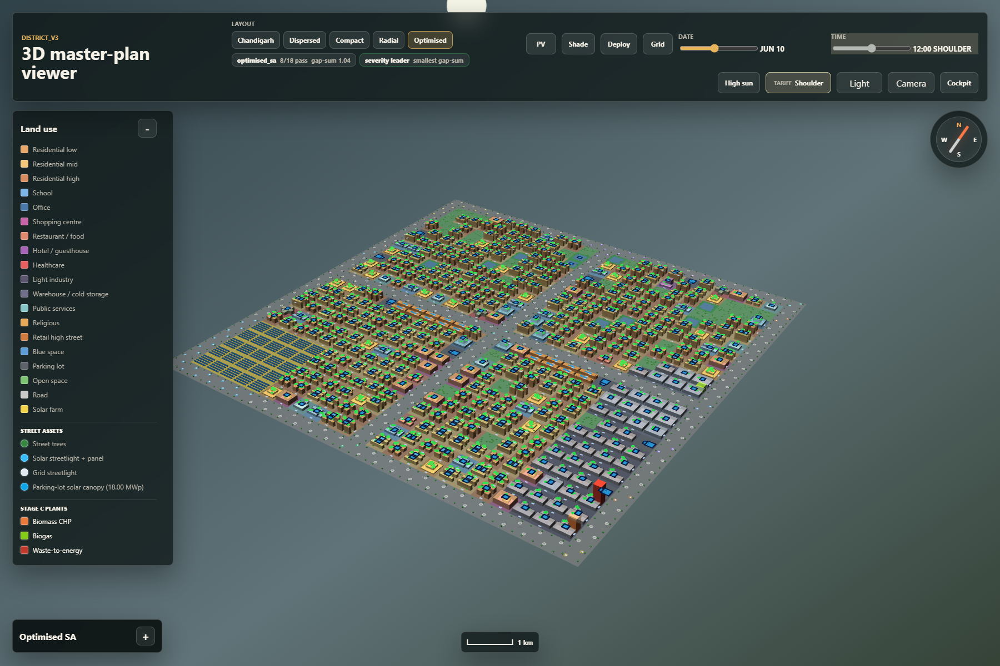
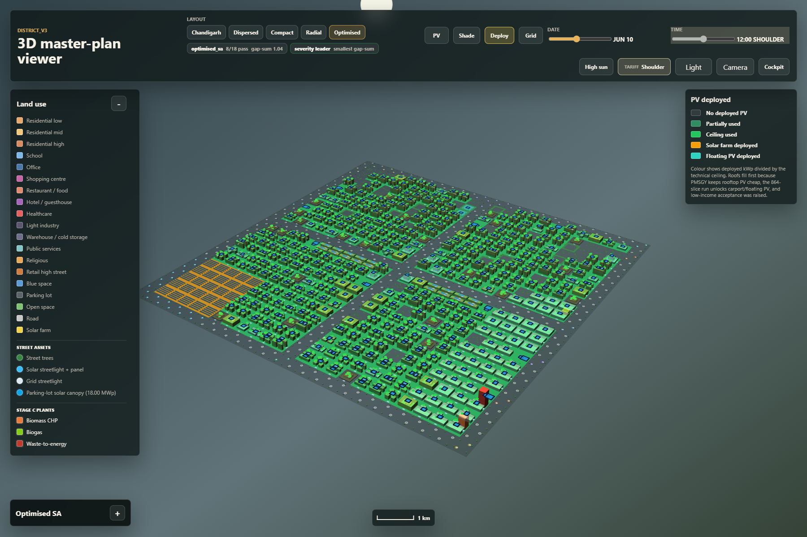
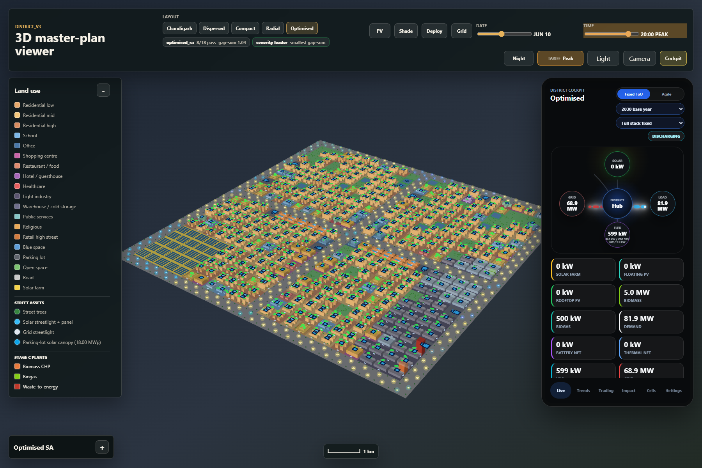

# Urban Design + Energy Co-Optimisation - a 3D Digital Twin of a Net-Zero Indian New Town

**MSc Thesis - Sustainable Energy Futures, Imperial College London (2025-26)**

A platform that designs a new town **and** its clean-energy system *together* - then renders the result as an interactive 3D digital twin you can fly through, with a live energy cockpit driven by the real optimisation results.

> **Source code:** kept private by design. This is an active research project I intend to open-source on my own timeline, so the optimisation engine is not published here. Happy to walk through it live (screen-share / interview).

https://github.com/user-attachments/assets/b14ff84e-9801-4e31-b2d2-449e74b6759b

---

## Headline results

A 25 km² (5 x 5 km) new town for **250,000 people** near Zirakpur, Punjab - designed from demographics up, powered to 2055.

| Metric (vs a conventional grid-only town on the same site) | Value |
|---|---|
| **Energy-system cost over the 25-year horizon** | **-41.6%** (45.8 billion INR saved) |
| Annual energy-system cost, opening year (2030) | **-48.8%** |
| Operational CO₂, opening year | **-59.4%** |
| Renewable supply share | **79.7%** (self-generated solar + biomass / waste-to-energy / biogas) |
| Net cost of energy served | **~3.54 INR/kWh** |
| Grid connection required | **145 MW vs 210 MW** - a 31% smaller tie to the grid |
| Equity | **The poorest residents save the most (47% lower bills)**, via government-financed rooftop PV and a 3 INR/kWh social tariff |

The **lifetime figure is the one that matters**, because a 25-year discounted cost is what the optimiser actually minimises. The single-year number is the opening position, not the answer - and the two behave differently, which turns out to be one of the more interesting results below.

The design is honest about time: the model plans in three investment periods (2030 / 2042 / 2055) with capex learning curves, panel degradation and a decarbonising grid.

---

## The idea

Master-planning a new town and planning its energy system are normally done separately, one after the other. That misses the biggest lever: **how a district is laid out - building heights, street orientation, shading, where demand sits, how much roof faces the sun - changes how much energy it needs in the first place.**

This project treats layout and energy as **one coupled optimisation problem**:

1. **Urban-design layer.** A simulated-annealing optimiser places land use, building heights and a connected road network across a **2,500-cell grid at 100 m resolution**, under **24 hard statutory planning constraints** (URDPFI / IPHS norms) and **39 weighted objectives**: solar access, passive cooling, walkability, equity of amenity access. No building is placed by hand, and none is placed freely: population and statutory norms fix **how much** of every use the plan must contain, and the optimiser decides only **where** each one goes.
2. **Energy layer.** Given that frozen layout, a Pyomo / HiGHS linear program co-optimises what to **build** (rooftop / ground-mount / carport / floating / facade solar, batteries, vehicle-to-grid, biomass / waste-to-energy / biogas, thermal storage) and how to **run it hour-by-hour**, across **864 representative time-slices** per year and three investment periods to 2055.

The two layers share one physics: the same sun-position and shadow geometry that lights the 3D scene also derates every roof's PV yield in the optimiser.

**What the optimiser actually builds:**

| | 2030 | 2042 | 2055 |
|---|---:|---:|---:|
| Solar farm (kWp) | 214,914 | 236,405 | 247,151 |
| Rooftop PV (kWp) | 129,089 | 129,089 | 148,452 |
| Battery (kWh) | **0** | **162,051** | **459,652** |
| Vehicle-to-grid units | 612 | 3,460 | 7,966 |

---

## The 3D digital twin

*The optimised district: buildings extruded by height, colour-coded land use, solar farm, carport canopies and energy plant - ~25 render layers in deck.gl / WebGL.*

https://github.com/user-attachments/assets/20537265-518a-4e6d-87ee-2e686629227a

*A full day in twenty seconds: the sun sweeps over the district and every shadow moves with it. The same solar-geometry engine that draws these shadows derates each roof's PV yield in the optimiser - the picture and the numbers come from one physics.*

*Night mode: lit buildings and the solar / grid streetlight split from the model.*

*Where the optimiser actually put solar: rooftops fill first, then carports, floating PV and the ground-mount farm.*

*The distribution network at noon: export arcs from PV-rich cells, import arcs into demand-heavy ones, transformer zones from the spatial (Stage D) model.*

*The live cockpit: generation, storage, vehicle-to-grid and grid exchange per hour, tariff curves, and the 2030 / 2042 / 2055 period selector - every number from the optimiser's solution file.*

More screenshots in [`media/`](media/).

A companion progressive web app, **Urja**, puts the same solution in a resident's hand: their household's live solar, grid draw and running cost, an EV charging view, and peer-to-peer trading. Every number traces back to the model; none is mocked up.

---

## What makes it interesting (beyond the headline)

- **The percentage advantage erodes while the money does not.** The saving runs 48.8% (2030) to 42.4% (2042) to 35.9% (2055) - but the *rupee* saving grows, from 1,778 to 1,880 million a year. The percentage falls only because the conventional town's bill grows 44% underneath it. Meanwhile the district becomes *less* grid-dependent, not more: imports fall from 38.6% to 26.2% of demand. What disappears is export revenue, as the town's own growth eats the midday surplus it used to sell.
- **Storage waits, and it is not an artefact.** No battery is economic in 2030; entry is 2042. That survives real discount rates of 0%, 3%, 5% and 7%, and a demand-flexibility band of 5% to 18%. Cheaper flexibility - managed EV charging and vehicle-to-grid - covers the evening peak first, and V2G survives a 1.8x to 2.6x charger-price shock before storage displaces it.
- **Expensive electricity helps this district.** A tariff rise driven by data-centre demand is normally framed as a risk. Here it is upside: the conventional town imports 100% of its energy and the district imports 39%, so dearer power hurts the baseline harder. At +2%/yr the lifetime saving rises to 52.3%, at +3.5%/yr to 60.6%. The tariff *level* moves the answer by 21 percentage points; the tariff *shape* by 0.4 - which retires an argument rather than settling it.
- **Resilience is emergent, not designed in.** Through a simulated month-long total grid outage the district serves **100% of critical load** - hospital, water treatment, public services, street lighting - in every period and every season, 72 hours out of 72 in an independent hour-by-hour simulation. Nobody specified that. The straw-fired CHP fleet the cost optimiser happened to build does it for free.
- **The plan is worth measuring on its own, separately from the energy system.** Against a baseline reproducing how Zirakpur actually grew, holding population and building programme identical: **16 of 20 planning constraints passed against 6**, **no home beyond 1 km of a school against 95**, and 15-minute-city coverage of **0.613 against 0.383**.
- **Equity is a first-class output.** Per-income-tier bills, peer-to-peer trading settlement, the social-tariff transfer, and per-owner payback / NPV - who pays, who saves, who needs co-financing. Rooftop PV is financed as a four-way blend by whoever actually owns each roof, from government-assisted EWS housing at 6% to private homes at 10%, rather than one flat rate for everybody.
- **It audits its own sources, and publishes the failures.** Three citations in this project were found to be fabricated or misattributed and were retracted - including one where a real report, correctly linked, simply did not contain the band attributed to it. Every parameter now carries a source, a URL and a tier label, and a verification register records what was opened, what was checked, and what could not be found. No headline number here rests on a citation nobody has read.
- **It audits its own arithmetic too.** The published solution is re-verified independently of the solver (energy balance to the kWh, every cap, every conservation law), and the project keeps a findings register of its own bugs and fixes - the same discipline expected of production energy models.

---

## Under the hood (engine, kept private)

| Layer | Approach |
|---|---|
| Urban design | Simulated annealing over a 2,500-cell grid, 24 hard constraints, 39 weighted objectives, frozen seed for reproducibility |
| Energy system | Pyomo / HiGHS LP, 864 time-slices x 3 periods (2030/2042/2055), vintaged capacity with learning curves |
| Realism | Geometric shading, temperature / soiling PV derating, monsoon cooling shapes, festival / weekend occupancy, EV charging by income tier, grid-decarbonisation trajectory, parasitic house load on every thermal plant |
| Equity | Tariff transfers, P2P settlement, social tariff, per-owner NPV - kept outside the cost optimisation as a report layer, so subsidies never distort the engineering optimum |
| Verification | Byte-exact regression pins, independent solution-feasibility tests (balance, caps, conservation), layout fingerprinting |
| Scale | ~57,000 lines of Python and ~13,000 of JavaScript, 347-case test suite |
| Stack | Python - Pyomo - HiGHS - NumPy / pandas - deck.gl / WebGL - GeoJSON |

---

## Demo

The screen-recording above is the quickest look (no setup needed). For a deeper walkthrough or a live look at the codebase, I am happy to arrange one.

---

*Aryan Bansal - MSc Sustainable Energy Futures, Imperial College London - [LinkedIn](https://www.linkedin.com/in/aryanbansal1210)*
